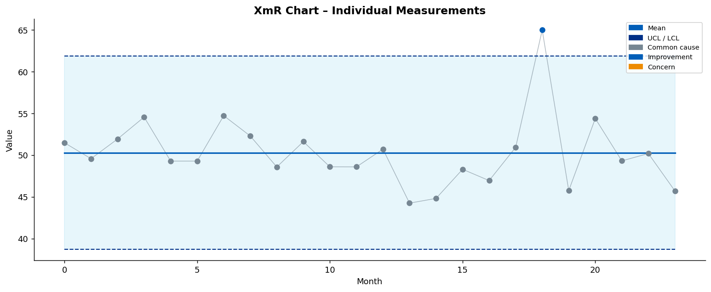
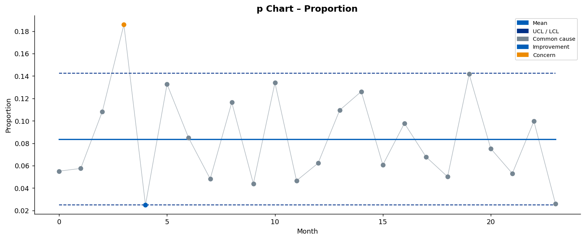
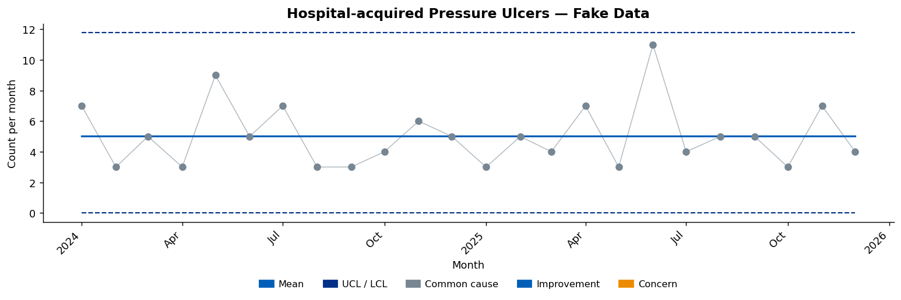
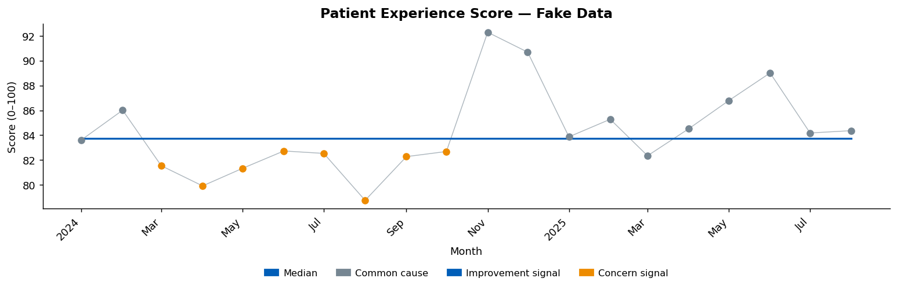
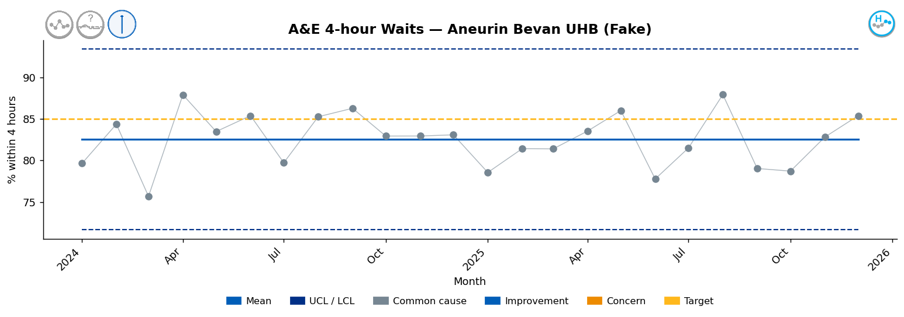
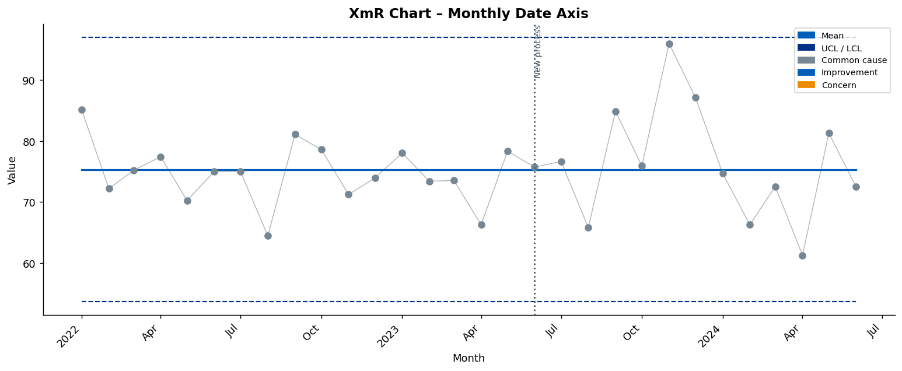
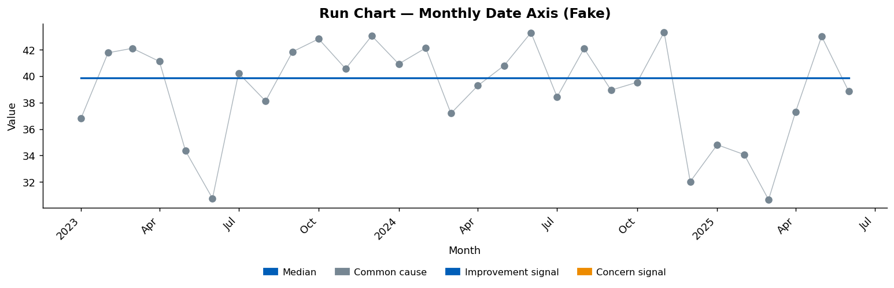
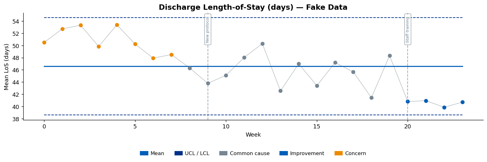
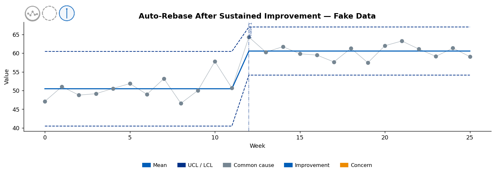

# biu_Making_Data_Count_CustomVisuals

Custom visuals implementing the NHS
[Making Data Count](https://www.england.nhs.uk/publication/making-data-count/) (MDC)
methodology for Statistical Process Control (SPC) charts.

This repository provides **ready-to-deploy chart components** across multiple
platforms:

| Platform | Status | Location |
|----------|--------|----------|
| **Python** (`abspc` package) | ✅ Available | [`abspc/`](abspc/) |
| **Looker** (LookML custom viz) | 🔜 Planned | `looker/` |
| **Looker Studio** (community viz) | 🔜 Planned | `looker_studio/` |

SPC rules are aligned with the NHS-R community's
[NHSRplotthedots](https://github.com/nhs-r-community/NHSRplotthedots) R package.
The Making Data Count methodology is developed by
[NHS England](https://www.england.nhs.uk/publication/making-data-count/) —
this project is an **independent, open-source implementation** and is not
affiliated with or endorsed by NHS England.

---

## Contents

- [Installation](#installation)
- [Quick Start](#quick-start)
- [Chart Types](#chart-types)
  - [XmR Chart](#xmr-chart)
  - [p Chart](#p-chart)
  - [c Chart](#c-chart)
  - [Run Chart](#run-chart)
- [Special-Cause Rules](#special-cause-rules)
- [Logo Placement](#logo-placement)
- [Date Axis](#date-axis)
- [Change-Point Annotations](#change-point-annotations)
- [Auto-Rebase on Sustained Improvement](#auto-rebase-on-sustained-improvement)
- [MDC Variation & Assurance Icons](#mdc-variation--assurance-icons)
- [NHS Colour Scheme](#nhs-colour-scheme)
- [API Reference](#api-reference)

---

## Installation

```bash
pip install abspc
```

Or install the development version from source:

```bash
git clone https://github.com/Aneurin-Bevan-University-Health-Board/biu_Making_Data_Count_CustomVisuals
cd biu_Making_Data_Count_CustomVisuals
pip install -e ".[dev]"
```

---

## Quick Start

```python
import pandas as pd
from abspc import plot_spc_chart, plot_run_chart

# Minimal XmR chart
data = pd.DataFrame({"value": [48, 52, 49, 55, 47, 51, 53, 50, 48, 54]})
fig, ax = plot_spc_chart(data, chart_type="XmR")
fig.savefig("my_xmr_chart.png")
```

---

## Chart Types

### XmR Chart

The XmR (individuals / moving-range) chart is the most common SPC chart type.
It is suitable for individual measurements collected over time.

```python
import numpy as np
import pandas as pd
from abspc import plot_spc_chart

data = pd.DataFrame({"value": np.random.normal(50, 3, 24)})

fig, ax = plot_spc_chart(
    data,
    chart_type="XmR",
    title="XmR Chart – Individual Measurements",
    xlabel="Month",
    ylabel="Value",
    shade_band=True,            # shade between UCL and LCL
    improvement_direction="high",
)
```



---

### p Chart

The p chart is for proportion data (e.g., percentage of patients waiting > 4 hours).
It requires a `subgroup_size` column containing the denominator for each period.

```python
data = pd.DataFrame({
    "value": [0.10, 0.12, 0.08, 0.15, 0.09, 0.11, 0.10, 0.13, 0.07, 0.12,
              0.09, 0.11, 0.10, 0.08, 0.14, 0.12, 0.09, 0.11, 0.08, 0.10,
              0.12, 0.09, 0.11, 0.10],
    "subgroup_size": [200] * 24,
})

fig, ax = plot_spc_chart(
    data,
    chart_type="p",
    title="p Chart – Proportion",
    xlabel="Month",
    ylabel="Proportion",
    improvement_direction="low",   # lower proportion = improvement
)
```



You can also pass a **numerator column** and a **denominator column**:

```python
data = pd.DataFrame({
    "events":     [20, 24, 16, 30, 18],
    "population": [200, 200, 200, 200, 200],
})
fig, ax = plot_spc_chart(
    data,
    chart_type="p",
    value_col="population",
    numerator_col="events",
    improvement_direction="low",
)
```

---

### c Chart

The c chart is for counts of events in a fixed sample size (e.g., number of
adverse events per ward per month).

```python
data = pd.DataFrame({"value": [3, 5, 2, 6, 4, 3, 7, 5, 4, 6,
                                 5, 3, 4, 6, 5, 4, 3, 5, 6, 4,
                                 3, 5, 4, 6]})

fig, ax = plot_spc_chart(
    data,
    chart_type="c",
    title="c Chart – Count of Events",
    xlabel="Month",
    ylabel="Count",
    improvement_direction="low",
)
```



---

### Run Chart

The run chart is a simpler chart that plots data against time with a **median**
centre line and no control limits.  It uses run-chart rules to detect signals
(7-point shift and 7-point trend).

```python
from abspc import plot_run_chart

data = pd.DataFrame({"value": np.random.normal(40, 4, 24)})

fig, ax = plot_run_chart(
    data,
    title="Run Chart – Median Centre Line",
    xlabel="Month",
    ylabel="Value",
    improvement_direction="high",
)
```



`plot_spc_chart` also accepts `chart_type="run"` and will automatically
delegate to `plot_run_chart`:

```python
fig, ax = plot_spc_chart(data, chart_type="run")
```

---

## Logo Placement

Pass any image (PNG, JPEG, etc.) via `logo_path` to display your organisation's
logo at the **top-right of the chart, level with the title**.  This works on
all five chart types.

```python
fig, ax = plot_spc_chart(
    data,
    chart_type="XmR",
    title="A&E 4-Hour Waits – Aneurin Bevan UHB",
    logo_path="path/to/logo.png",   # ← any image file
    logo_zoom=0.08,                  # ← height as fraction of figure (default 0.07)
)
```



The logo is right-aligned with the plot area and bottom-aligned with the top
edge of the axes, so it sits naturally beside the title text.

| Parameter | Type | Default | Description |
|-----------|------|---------|-------------|
| `logo_path` | `str \| None` | `None` | Path to logo image file |
| `logo_zoom` | `float` | `0.07` | Logo height as fraction of figure height |

The same parameters work on `plot_run_chart`:

```python
fig, ax = plot_run_chart(data, logo_path="logo.png", logo_zoom=0.09)
```

> **Note:** `logo_path` places the logo **in the title margin** (top-right).
> The existing `nhs_logo_path` parameter is still supported and places an image
> *inside* the plot area at the lower-right corner.

---

## Date Axis

All chart functions automatically detect datetime data on the x-axis and apply
smart date tick formatting.  No extra steps are needed — just pass a DataFrame
with a `DatetimeIndex` or an explicit date column.

### Option 1 – `DatetimeIndex` (auto-detected)

```python
import pandas as pd
import numpy as np
from abspc import plot_spc_chart

dates = pd.date_range("2022-01-01", periods=30, freq="MS")  # monthly
data  = pd.DataFrame({"value": np.random.normal(75, 6, 30)}, index=dates)

fig, ax = plot_spc_chart(
    data,
    chart_type="XmR",
    title="XmR Chart – Monthly Date Axis",
    xlabel="Month",
    ylabel="Value",
    change_points=[
        {"x": pd.Timestamp("2023-06-01"), "label": "New process"},
    ],
)
```



> The tick labels are automatically rotated 45° and formatted by
> matplotlib's `ConciseDateFormatter` (e.g. *Jan 2022*, *2023*).

### Option 2 – Explicit date column (`x_col`)

```python
dates = pd.date_range("2021-04-01", periods=24, freq="MS")
data  = pd.DataFrame({"period": dates, "value": np.random.normal(50, 4, 24)})

fig, ax = plot_run_chart(
    data,
    x_col="period",           # ← name of the date column
    title="Run Chart – Date Column",
    xlabel="Month",
    ylabel="Value",
    date_format="%b %Y",      # ← optional manual format
)
```



### `date_format` parameter

Override the automatic format with any `strftime`-style string:

| `date_format` | Example output |
|---------------|----------------|
| `"%b %Y"` | Jan 2024 |
| `"%Y-%m"` | 2024-01 |
| `"%d/%m/%Y"` | 01/01/2024 |
| `None` *(default)* | Auto (ConciseDateFormatter) |

`change_points` work seamlessly with date axes — pass a `pd.Timestamp` (or any
value accepted by `axvline`) as the `"x"` key:

```python
change_points=[
    {"x": pd.Timestamp("2023-06-01"), "label": "New protocol"},
]
```

---

## Special-Cause Rules

The package implements four NHS MDC rules (aligned with NHSRplotthedots):

| Rule | Name | Description |
|------|------|-------------|
| **Rule 1** | Astronomical point | Single value outside the 3σ control limits (UCL/LCL) |
| **Rule 2** | Shift | ≥ 7 consecutive points all above **or** all below the mean |
| **Rule 3** | Trend | ≥ 7 consecutive points all going up **or** all going down |
| **Rule 4** | Two-in-three | 2 out of 3 consecutive points in the 2σ–3σ warning zone, on the same side of the mean |

Points are coloured according to the NHS MDC scheme:

| Colour | Meaning |
|--------|---------|
| 🔵 NHS Blue `#005EB8` | Improvement (special cause in the improvement direction) |
| 🟠 NHS Orange `#ED8B00` | Concern (special cause in the wrong direction) |
| ⬜ Grey `#768692` | Common cause (no signal) |

### Using the detection functions directly

```python
from abspc import calculate_control_limits, detect_special_causes

result = calculate_control_limits(data, chart_type="XmR")
flags  = detect_special_causes(result)

# flags contains: rule1, rule2, rule3, rule4, special_cause
print(flags[["value", "mean", "ucl", "lcl", "rule1", "rule2", "rule3", "rule4", "special_cause"]])
```

---

## Change-Point Annotations

Use `change_points` to mark known process changes (protocol updates, staff
changes, equipment replacements, etc.) with vertical lines and labels.

```python
fig, ax = plot_spc_chart(
    data,
    chart_type="XmR",
    title="XmR Chart with Change-Point Annotations",
    change_points=[
        {"x": 9,  "label": "New protocol"},
        {"x": 20, "label": "Staff training"},
    ],
)
```



The `x` value can be a numeric index or a date if your x-axis uses dates via
`x_col`.  Each dict requires `"x"` and `"label"` keys.

`change_points` is also supported by `plot_run_chart`:

```python
fig, ax = plot_run_chart(
    data,
    change_points=[{"x": 12, "label": "Intervention"}],
)
```

---

## Auto-Rebase on Sustained Improvement

When **statistical improvement** has been sustained (≥ 7 consecutive points in
the improvement direction relative to the current mean), the control limits can
be automatically recalculated for the new phase.

Set `auto_rebase=True` to enable this.  When a phase boundary is detected, a
dashed vertical line is drawn and the mean/UCL/LCL are recalculated from that
point forward.

```python
fig, ax = plot_spc_chart(
    data,
    chart_type="XmR",
    title="XmR Chart with Auto-Rebase on Sustained Improvement",
    improvement_direction="high",
    auto_rebase=True,        # ← enable auto-rebase
)
```



You can also use `rebase_control_limits` directly to get the phase-annotated
DataFrame without plotting:

```python
from abspc import rebase_control_limits

result = rebase_control_limits(
    data,
    chart_type="XmR",
    improvement_direction="high",
    min_phase_length=7,        # minimum points to trigger a rebase (default 7)
)

# result contains: mean, ucl, lcl, uwl, lwl, rebase_phase
print(result[["value", "mean", "ucl", "rebase_phase"]])
```

> **Note:** Auto-rebase is supported for `XmR`, `p`, `u`, and `c` charts.
> It is not available for run charts (use `plot_run_chart` instead).

---

## MDC Variation & Assurance Icons

The package can automatically determine and display the official
[Making Data Count](https://www.england.nhs.uk/publication/making-data-count/)
variation and assurance icons on any chart.  Set `show_icons=True` to enable
them — both icons appear at the **top-left** of the plot area.

**Variation** (left icon) describes the type of special-cause variation in the
most recent data.  **Assurance** (right icon) describes whether the process is
consistently capable of meeting the target.

The full icon matrix is shown below — the **variation icon** corresponds to the
row and the **assurance icon** corresponds to the column:

<table>
  <thead>
    <tr>
      <th></th>
      <th align="center">Pass<br/><sub>Target will consistently<br/>be met</sub></th>
      <th align="center">Hit or Miss<br/><sub>Target may or may not<br/>be met</sub></th>
      <th align="center">Fail<br/><sub>Target will consistently<br/>not be met</sub></th>
    </tr>
  </thead>
  <tbody>
    <tr>
      <td><strong>Improvement (high)</strong><br/><sub>Special-cause variation<br/>in the improvement<br/>direction (high)</sub></td>
      <td align="center"> </td>
      <td align="center"> </td>
      <td align="center"> </td>
    </tr>
    <tr>
      <td><strong>Improvement (low)</strong><br/><sub>Special-cause variation<br/>in the improvement<br/>direction (low)</sub></td>
      <td align="center"> </td>
      <td align="center"> </td>
      <td align="center"> </td>
    </tr>
    <tr>
      <td><strong>Common Cause</strong><br/><sub>No special-cause<br/>variation detected</sub></td>
      <td align="center"> </td>
      <td align="center"> </td>
      <td align="center"> </td>
    </tr>
    <tr>
      <td><strong>Concern (high)</strong><br/><sub>Special-cause variation<br/>in the concern<br/>direction (high)</sub></td>
      <td align="center"> </td>
      <td align="center"> </td>
      <td align="center"> </td>
    </tr>
    <tr>
      <td><strong>Concern (low)</strong><br/><sub>Special-cause variation<br/>in the concern<br/>direction (low)</sub></td>
      <td align="center"> </td>
      <td align="center"> </td>
      <td align="center"> </td>
    </tr>
  </tbody>
</table>

> For run charts only the variation icon is shown (no control limits means
> assurance cannot be calculated).

### Usage

```python
from abspc import plot_spc_chart

fig, ax = plot_spc_chart(
    data,
    chart_type="XmR",
    title="XmR Chart with MDC Icons",
    improvement_direction="high",
    target=60,
    show_target=True,
    show_icons=True,          # ← enable MDC icons
    icon_zoom=0.06,           # ← icon height as fraction of figure (default)
)
```

The icons are sourced from the official
[nhsengland/making-data-count](https://github.com/nhsengland/making-data-count)
repository and are bundled with the package.

### Programmatic Access

You can also determine the variation and assurance types directly without
plotting:

```python
from abspc import (
    calculate_control_limits,
    detect_special_causes,
    determine_variation_type,
    determine_assurance_type,
)

result = calculate_control_limits(data, chart_type="XmR")
result = detect_special_causes(result)

variation = determine_variation_type(
    result, value_col="value", improvement_direction="high",
)
assurance = determine_assurance_type(
    result, target=60, improvement_direction="high",
)

print(f"Variation: {variation}")   # e.g. "improvement_high"
print(f"Assurance: {assurance}")   # e.g. "pass"
```

| Parameter | Type | Default | Description |
|-----------|------|---------|-------------|
| `show_icons` | `bool` | `False` | Display MDC variation & assurance icons at the top-left of the chart. |
| `icon_zoom` | `float` | `0.06` | Icon height as a fraction of figure height. Increase for larger icons. |

---

## NHS Colour Scheme

All charts use the NHS identity palette:

| Colour | Hex | Usage |
|--------|-----|-------|
| NHS Blue | `#005EB8` | Mean / median line, improvement points |
| NHS Dark Blue | `#003087` | UCL / LCL lines |
| NHS Orange | `#ED8B00` | Concern points |
| Grey | `#768692` | Common-cause points, data connector line |
| NHS Warm Yellow | `#FFB81C` | Optional target line |
| NHS Light Blue | `#41B6E6` | Optional tolerance-band shading |
| NHS Pale Grey | `#E8EDEE` | Alternate tolerance-band shading |

---

## API Reference

### `plot_spc_chart`

```python
fig, ax = plot_spc_chart(
    data,
    chart_type,           # "XmR" | "p" | "u" | "c" | "run"
    value_col="value",
    subgroup_col="subgroup_size",
    numerator_col=None,
    x_col=None,           # date column name; DatetimeIndex auto-detected
    title=None,
    xlabel="Observation",
    ylabel="Value",
    improvement_direction="high",   # "high" | "low"
    target=None,
    show_target=False,
    shade_band=False,
    shade_color="#41B6E6",
    nhs_logo_path=None,
    ax=None,
    figsize=(12, 5),
    show_legend=True,
    change_points=None,   # [{"x": ..., "label": "..."}, ...]
    auto_rebase=False,
    date_format=None,     # strftime string, e.g. "%b %Y"
    logo_path=None,       # top-right logo aligned with title
    logo_zoom=0.07,       # logo height as fraction of figure height
    show_icons=False,     # MDC variation & assurance icons
    icon_zoom=0.06,       # icon height as fraction of figure height
)
```

| Parameter | Type | Default | Description |
|-----------|------|---------|-------------|
| `data` | `pd.DataFrame` | *(required)* | Input DataFrame. Must contain at least the column named by `value_col`. For `"p"` and `"u"` charts it must also contain the `subgroup_col` column. |
| `chart_type` | `str` | *(required)* | Chart type: `"XmR"`, `"p"`, `"u"`, `"c"`, or `"run"` (case-insensitive). `"run"` delegates to `plot_run_chart`. |
| `value_col` | `str` | `"value"` | Name of the column containing the measured values. |
| `subgroup_col` | `str \| None` | `"subgroup_size"` | Column with subgroup / denominator sizes. Required for `"p"` and `"u"` charts; ignored for others. |
| `numerator_col` | `str \| None` | `None` | For `"p"` charts: column with event counts when `value_col` holds the denominator. The proportion is computed as `numerator / value`. |
| `x_col` | `str \| None` | `None` | Column to use as the x-axis. When `None`, uses the DataFrame's `DatetimeIndex` if present, otherwise integer positions `0, 1, 2, …`. |
| `title` | `str \| None` | `None` | Chart title. Auto-generated from `chart_type` if omitted (e.g. *"XmR Chart"*). |
| `xlabel` | `str` | `"Observation"` | Label for the x-axis. |
| `ylabel` | `str` | `"Value"` | Label for the y-axis. |
| `improvement_direction` | `str` | `"high"` | `"high"` or `"low"` — whether higher values represent improvement. Controls point colouring (blue = improvement, orange = concern). |
| `target` | `float \| None` | `None` | Optional target value. When set with `show_target=True`, a dashed target line is drawn. Also influences improvement colouring. |
| `show_target` | `bool` | `False` | Draw a dashed NHS Warm Yellow target line at `target`. Requires `target` to be set. |
| `shade_band` | `bool` | `False` | Fill the region between UCL and LCL with a translucent band. |
| `shade_color` | `str` | `"#41B6E6"` | Colour for the tolerance-band shading (default NHS Light Blue). |
| `nhs_logo_path` | `str \| None` | `None` | Path to an image overlaid **inside** the axes at the lower-right corner (legacy). Use `logo_path` for title-aligned placement instead. |
| `ax` | `matplotlib.axes.Axes \| None` | `None` | Axes to draw on. A new figure and axes are created when `None`. Pass an existing `Axes` to embed the chart in a subplot grid. |
| `figsize` | `tuple[float, float]` | `(12, 5)` | Figure size in inches `(width, height)`. Ignored when `ax` is provided. |
| `show_legend` | `bool` | `True` | Add a colour legend to the chart. |
| `change_points` | `list[dict] \| None` | `None` | Vertical annotation lines marking process changes. Each dict needs `"x"` (position) and `"label"` (text). Example: `[{"x": 10, "label": "New protocol"}]`. |
| `auto_rebase` | `bool` | `False` | Auto-detect sustained improvement shifts (≥ 7 consecutive points) and recalculate limits for each new phase. Draws a dashed vertical line at each phase boundary. Not supported for `"run"`. |
| `date_format` | `str \| None` | `None` | `strftime`-style format for the x-axis when datetime values are detected (e.g. `"%b %Y"`). `None` uses matplotlib's `ConciseDateFormatter`. |
| `logo_path` | `str \| None` | `None` | Path to a logo image (PNG, JPEG, etc.) placed at the **top-right of the figure, in line with the title**. |
| `logo_zoom` | `float` | `0.07` | Logo height as a fraction of figure height. Increase for a larger logo. |
| `show_icons` | `bool` | `False` | Display MDC variation & assurance icons at the top-left of the chart. |
| `icon_zoom` | `float` | `0.06` | Icon height as a fraction of figure height. |

**Returns:** `(fig, ax)` — a `matplotlib.figure.Figure` and `matplotlib.axes.Axes`.

---

### `plot_run_chart`

```python
fig, ax = plot_run_chart(
    data,
    value_col="value",
    x_col=None,           # date column name; DatetimeIndex auto-detected
    title=None,
    xlabel="Observation",
    ylabel="Value",
    improvement_direction="high",
    target=None,
    show_target=False,
    nhs_logo_path=None,
    ax=None,
    figsize=(12, 5),
    show_legend=True,
    change_points=None,   # [{"x": ..., "label": "..."}, ...]
    date_format=None,     # strftime string, e.g. "%b %Y"
    logo_path=None,       # top-right logo aligned with title
    logo_zoom=0.07,       # logo height as fraction of figure height
    show_icons=False,     # MDC variation icon
    icon_zoom=0.06,       # icon height as fraction of figure height
)
```

| Parameter | Type | Default | Description |
|-----------|------|---------|-------------|
| `data` | `pd.DataFrame` | *(required)* | Input DataFrame containing at least the `value_col` column. |
| `value_col` | `str` | `"value"` | Name of the column containing the measured values. |
| `x_col` | `str \| None` | `None` | Column to use as the x-axis. Auto-detects `DatetimeIndex`; falls back to integer positions. |
| `title` | `str \| None` | `None` | Chart title. Defaults to `"Run Chart"` if omitted. |
| `xlabel` | `str` | `"Observation"` | Label for the x-axis. |
| `ylabel` | `str` | `"Value"` | Label for the y-axis. |
| `improvement_direction` | `str` | `"high"` | `"high"` or `"low"` — controls point colouring for detected signals. |
| `target` | `float \| None` | `None` | Optional target value. Drawn as a dashed line when `show_target=True`. |
| `show_target` | `bool` | `False` | Draw a dashed target line at `target`. |
| `nhs_logo_path` | `str \| None` | `None` | Path to a logo image overlaid inside the axes (legacy). |
| `ax` | `matplotlib.axes.Axes \| None` | `None` | Axes to draw on. A new figure / axes is created when `None`. |
| `figsize` | `tuple[float, float]` | `(12, 5)` | Figure size in inches `(width, height)`. |
| `show_legend` | `bool` | `True` | Add a colour legend to the chart. |
| `change_points` | `list[dict] \| None` | `None` | Vertical annotation lines. Each dict needs `"x"` and `"label"`. |
| `date_format` | `str \| None` | `None` | `strftime`-style format for datetime x-axis (e.g. `"%b %Y"`). |
| `logo_path` | `str \| None` | `None` | Logo image placed at the top-right of the figure. |
| `logo_zoom` | `float` | `0.07` | Logo height as a fraction of figure height. |
| `show_icons` | `bool` | `False` | Display MDC variation icon at the top-left of the chart. |
| `icon_zoom` | `float` | `0.06` | Icon height as a fraction of figure height. |

**Returns:** `(fig, ax)` — a `matplotlib.figure.Figure` and `matplotlib.axes.Axes`.

### `calculate_control_limits`

Returns the input DataFrame extended with `mean`, `ucl`, `lcl`, `uwl`, `lwl`
columns (or just `mean` for run charts).

### `detect_special_causes`

Returns the DataFrame from `calculate_control_limits` extended with boolean
columns `rule1`, `rule2`, `rule3`, `rule4`, and `special_cause`.

### `detect_run_chart_signals`

Returns the DataFrame from `calculate_control_limits(chart_type="run")`
extended with `run_shift`, `run_trend`, and `run_signal`.

### `rebase_control_limits`

Returns the DataFrame from `calculate_control_limits` with limits recalculated
per improvement phase and a `rebase_phase` integer column.

---

## Running Tests

```bash
pip install -e ".[dev]"
pytest
```

106 unit tests covering all chart types, SPC rules, run-chart signals,
auto-rebase, change-point annotations, and plotting.

---

## Licence & Attribution

This project is released under the [MIT Licence](LICENSE).

The **Making Data Count** methodology is developed and maintained by
[NHS England](https://www.england.nhs.uk/publication/making-data-count/).
SPC rules implemented here are aligned with the
[NHSRplotthedots](https://github.com/nhs-r-community/NHSRplotthedots) R
package by the NHS-R Community.

This repository is an **independent, open-source implementation** created by
**Aneurin Bevan University Health Board** and is not affiliated with, endorsed
by, or officially connected to NHS England or the NHS-R Community.
